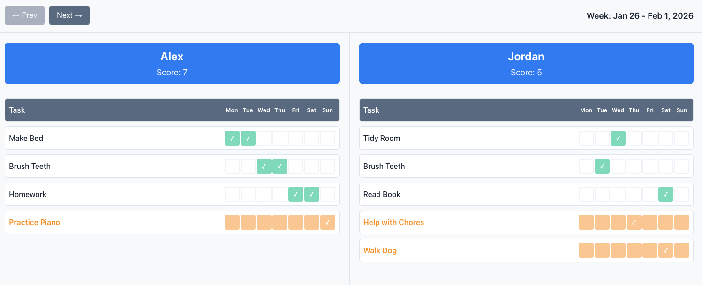

# Ticks and Tokens

A digital dashboard for tracking kids' weekly tasks and managing screen time tokens. Replaces paper-based task sheets with an interactive display suitable for wall-mounting on a 23" screen.



## Features

- **Dual Dashboard**: Side-by-side view of both children's progress
- **Weekly Tasks**: Track completion with simple button clicks
- **Score Calculation**: Automatic counting and coin reward system
- **ScreenTimeTokens**: 7 tokens per week, deductable for misbehavior
- **Celebrations**: Animations and audio for achievement milestones

## Quick Start

1. **Clone to Raspberry Pi**:
   ```bash
   # On your Raspberry Pi
   cd /home
   git clone https://github.com/your-username/ticks_and_tokens.git
   cd ticks_and_tokens
   ```

2. **Launch Dashboard**:
   ```bash
   ./launch.sh
   ```

3. **Development**: Open `index.html` in any modern browser for testing

## Development

- `index.html` - Main dashboard layout
- `src/main.js` - Core application logic and game loop
- `MVP.md` - Complete feature specification

## Deployment

The dashboard is designed to run on Raspberry Pi with Chromium in kiosk mode. Push changes to GitHub, pull on the Pi, and refresh the browser to deploy updates.
